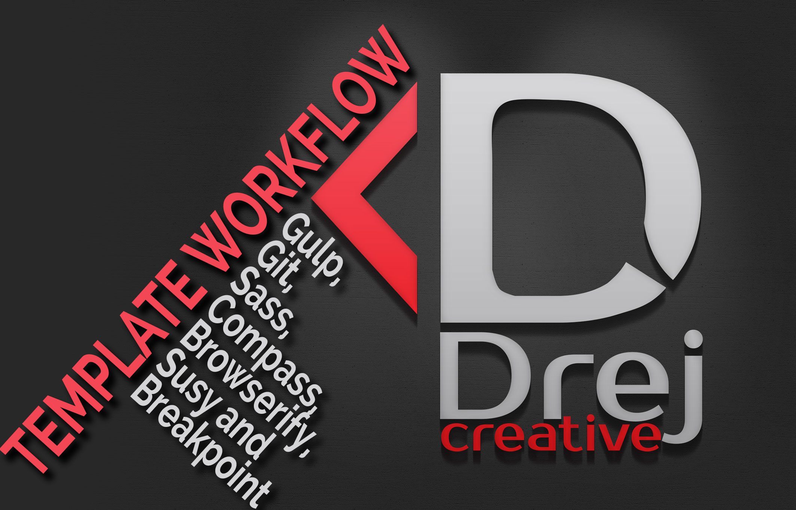

# A simple template for workflow with Gulp, Git, Sass, Compass, Browserify, Susy and Breakpoint

This is my template for simple Gulp workflow with Git, Sass, Compass, Browserify, Susy and Breakpoint. This template give you few thing. First, Gulp compile your Sass into css. Secound you can automatically minify your css and javascripts, and then Gulp give you livereload of your web project in browser.
Susy and Breakpoint give you simple and custom responsive framework.

##Instructions

Make sure you have these installed

1. [Node.js](hwww.nodejs.org).
2. [git](www.git-scm.com).
3. [grunt](www.gruntjs.com).

Clone this repository into your local machine using the terminal (mac) or Gitbash (PC)
`git clone  https://github.com/drejcreative/Template-for-workflow-with-Glup-Git-Sass-Compass-Browserify-Susy-and-Breakpoint.git`

CD to the folder with workflows
Run > `npm-install` to install the project dependencies

Install gulp.js via the Mac terminal or Gitbash on a PC > `npm install -g gulp`

Run the Gulp command > `gulp`

And add `http://localhost:9999` to you browser to live preview your work
